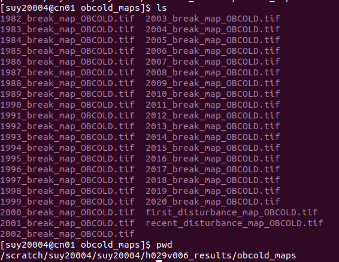

# pycold-uconnhpc

# A script repo for applying pycold package in UCONN HPC environment
### Author: Su Ye (remotesensingsuy@gmail.com)

## Before you use....

Hi GERSers,

When you started reading this repo, it indicates that you are thinking about using [pycold](https://github.com/GERSL/pycold) in the UCONN HPC to process big-data **tile-based time series dataset**. 

First, I recommend using pip over conda to set up your python environment. Conda worked well in most cases except for when it occasionally has conflicts with pip-installed packages. Considering pip has more package supports (such as Earthpy), I chose a uniform pip environment which guarantees that we could successfully install almost common geomatic packages. 

If you are Window system user and choose python as your primary programming language, Cygwin terminal (https://www.cygwin.com/) is recommended, as other window-based terminals such as Mobabus may have issues with Jupyter notebook connection.  Another advantage of using CLI-based terminal than GUI-based is CLI-based terminal often incorporates many useful softwares such as git and conda, where you can better keep up with modern computational technology. 

## Step 1: install a pip environment

Let's start with an interative node

```
fisbatch -n 1 --partition=EpycPriority --nodelist=cn449 --account=zhz18039
```

To create a pip virtual environment

```
mkdir ~/Document/pipenv   # create a folder to put pip environment file
cd ~/Document/pipenv
python3 -m venv ts-py38   # create a pip
```


## Step 2: install pycold and other essential geo packages

clone repo from our lab github page (assuming you are still in the interactive model, and git can't be supported in the login node)

```
cd ~/Document
git clone https://github.com/GERSL/pycold/pycold.git
```

cd to the repo, load required modules in UCONN environment and activate the environment

```
cd pycold
module purge
# load commonly-used module
module load gcc/5.4.0-alt sqlite/3.18.0 tcl/8.6.6.8606 zlib/1.2.11 libjpeg-turbo/1.5.90 openssl/1.0.2o libcurl/7.60.0 jasper/1.900.1 proj/4.9.3 szip/2.1.1 hdf4/4.2.13 java/1.8.0_162 mpi/openmpi/3.1.0-gcc hdf5/1.10.2-gcc-openmpi netcdf/4.6.1-gcc-openmpi geos/3.5.0 gdal/2.2.0
module load zlib/1.2.11
module load java/1.8.0_162
module load gsl/2.4
source ~/Document/pipenv/ts-py38/bin/activate    # activate the pip environment
```

Install requirements

```
pip install -r requirements.txt
```

install pycold in development mode (The benefit you get from developers mode is that when you make a change to Python code, you see that change immediately when you rerun the program )

```
bash run_developer_setup.sh
```

A quick test using the python console

```python
>> import pycold
```

** Note that the pycold can be only successfully installed in OCX and Linux platform temporally. I encounterred a compiler issue in the Window system, and will work on Window platform some time point in this year.


## Step 3: tile-based processing

I provided two ways for running [pycold](https://github.com/GERSL/pycold) for tile-based processing. 1) pipeline mode; and 2) step-by-step mode. The pipeline mode enables you submitted **a single job** to finish a pipeline of stacking, per-pixel time-series processing, and outputted maps. The step-by-step mode will allow you to re-run individual step mostly for testing purpose.

First, clone this repo:

```
git clone https://github.com/GERSL/pycold-uconnhpc.git
cd pycold-uconnhpc
```

### 3.1 pipeline mode

Edit Line 4 - 10 in [pipeline_pycold.sh](pipeline_pycold.sh), as you needed:

- h: the horizontal id of your ARD tile
- v: the vertical id of your ARD tile
- method: the algorithm you chose for running, 'COLD', 'OBCOLD' and 'SCCD'
- yaml_path: the configuration yaml for algorithm
- pycold_path: the pycold package path
- working_dir: the path to save stack and result files.  Two folder will be outputted 1) 'working_dir/h029v006_stack' and 2) 'working_dir/h029v006_results'.
- pip_env: the path for the pip environment

#### Run pipeline_pycold.sh

For the first run, try

```
bash pipeline_pycold.sh c
```

The 'c' here means 'complete', which specifically includes the step of stacking. 

Sometimes you may encounter the job failure due to the failure of the random core. You can run the below, which will skip the step of stacking (I assume that the stacking step worked without any problem, which is usually the case):

```
bash pipeline_pycold.sh
```

If success, you can see the outputs in 'working_dir/h029v006_results/obcold_maps' for OB-COLD, or 'working_dir/h029v006_results/cold_maps' for OB-COLD (assuming you are running the tile h029v006). **The image file started with 'year' **represent the change break for simple year. It is a four-digit number. The first digit has three possible values: 1 - disturbance, 2 - recovery, 3 - afforestation (note that the Matlab version put '3' as disturbance, '1' as afforestation). The second to fourth digits represent the doy of the year. **first_disturbance_map_OBCOLD.tif** is an ensemble of all yearly disturbance map which use the first disturbance year as the pixel value; **recent_disturbance_map_OBCOLD.tif** is an ensemble of all yearly disturbance map which use the last disturbance year as the pixel value.



 

#### Other notes:

* After you change the above files for the first time, you only need to change 'h' and 'v' for the next time to point to your interested tiles, so it is very easy to use.
* Feel free to add '\#SBATCH --mail-user=' into the slurm files if you want to receive email notification.


## 3.2 step-by-step mode

This mode allows you to run individual step

#### 3.2.1 submit_prepareard_ard_template.sh

A script for submitting the stacking job. Please firstly rename it to **submit_prepareard_ard.sh**. The reason for doing this is I already add submit_prepareard_ard.sh to .gitignore, so the next time you pull from the recent git repo, your slurm files won't be overwritten.

```
mv submit_prepareard_ard_template.sh submit_prepareard_ard.sh
```

To use it, you need to change the below two lines:

```
h="027"   # the h id of your ard tile
v="009"    # the v id of your ard tile
working_dir="/scratch/your_scratch_folder"   # the place to save the result folder
yaml_path="/your_pycold-uconnhpc_path/pycold-uconnhpc/config.yaml"
pycold_path="/your_pycold_path/pycold"
```

Then submit the job

```
sbatch submit_prepareard_ard.sh
```

This job typically took 15 mins  to finish (200 cores, skylake or EpycPriority nodes); you will see a folder named 'h027v009 _stack' created in working_dir.

#### 3.2.2 submit_tileprocessing_ard_template.sh: 

A script for submitting the COLD algorithm job. Again, please rename it to **submit_tileprocessing_ard.sh** first. To use it, you need to change below five lines in **submit_tileprocessing_ard.sh**. 

```
h="029"   
v="006" 
working_dir="/scratch/your_scratch_folder"  
yaml_path="/your_pycold-uconnhpc_path/pycold-uconnhpc/config.yaml"
pycold_path="/your_pycold_path/pycold"
```

Then submit the job:

```
sbatch submit_tileprocessing_ard.sh
```

This process typically took 1-1.5 hours to finish (200 cores, skylake or EpycPriority nodes); you will see a folder named 'h029v006' created in working_dir.

#### 3.2.3 submit_exportChangeMap_ard_template.sh 

a script for submitting a job for exporting change map. Rename it to **submit_exportChangeMap_ard.sh**, and then change the below our lines:

```
h="027"
v="009"
method="COLD"
reccg_path="/scratch/your_scratch_folder/h${h}v${v}_results"
out_path="/scratch/your_scratch_folder/h${h}v${v}_results"
yaml_path="/your_pycold-uconnhpc_path/pycold-uconnhpc/config.yaml"
pycold_path="/your_pycold_path/pycold"
```

Then submit the job

```
sbatch submit_exportChangeMap_ard.sh
```

The outputted map will be saved in "/scratch/suy20004/h${h}v${v}_results/obcold_maps", if everything works well


## 3.3 Other notes

#### 3.3.1 config.yaml

The package relies on config.yaml to control configuration. Just change it as you need. There are seven parameters so far:

- n_rows: the row number of the dataset 

- n_cols: the col number of the dataset

- n_block_x: the block number along with x axis. 

- n_block_y: the block number along with y axis

- probability_threshold: change probability, default is 0.99 

- conse: consecutive number of observation for change decision

- CM_OUTPUT_INTERVAL:  interval days for outputing change magnitudes, only useful for OBCOLD

*Different with MATLAB version that uses scanline as processing unit, the whole software use a square-like block as parallelization unit; this way can greatly reduce disk by eliminating those blocks that has all invalid pixels or cloud/shadow blocks. As a result, it only only need ~300 GB space for stacking files, and also much faster for deleting the files.*

### 3.3.2 Other examples for pycold

A [jupyter notebook](https://github.com/GERSL/pycold/blob/devel/tool/notebook/pycold_example.ipynb) for displaying time series and break from a csv-based time series


